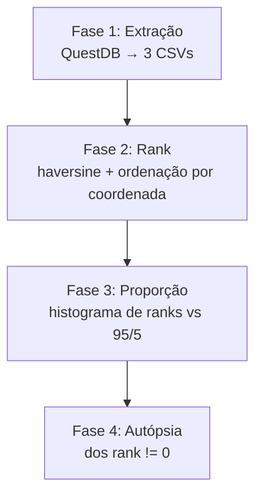

# Plano — Validação do algoritmo de seleção de servidor (95/5) nos dados

> Data: 07/09/2026
> Premissa: o algoritmo já foi extraído do código fonte do M-Lab — ver `PESQUISA_SELECAO_SERVIDOR.md`, seção 9
> Status: planejamento aprovado, execução iniciando

---

## 1. Objetivo

Verificar se a base de testes NDT é consistente com o comportamento documentado no código do M-Lab:

- ~95% dos testes no site geograficamente mais próximo (haversine)
- ~5% no 2º mais próximo
- ~0% no 3º ou além

E investigar os desvios (outliers): quem são, quando ocorrem e se têm padrão.

---

## 2. Decisões de projeto (copiadas do código, não inventadas)

| Decisão             | Definição no código M-Lab                                           | Consequência para a análise                                        |
| ------------------- | ------------------------------------------------------------------- | ------------------------------------------------------------------ |
| **Unidade**         | site (`server_site`), não máquina                                   | rank calculado por site; máquina é sorteio uniforme dentro do site |
| **Distância**       | haversine (linha reta, R = 6371 km)                                 | mesma fórmula, sem ajustes                                         |
| **Empate**          | não existe — ordenação estrita por distância                        | sem tolerância de km                                               |
| **Probabilidade**   | exponencial rate=6: rank 0 ≈ 95,02%, rank 1 ≈ 4,98%, rank 2 ≈ 0,01% | expectativa do histograma                                          |
| **Filtros prévios** | `isHealthy()` + `pickWithProbability(Probability)`                  | o rank real do momento pode diferir do calculado offline           |

**Unidade de análise = o teste.** Cada teste contribui com uma observação: "neste teste, o rank do servidor usado foi X". Se um cliente fez 100 testes e 95 foram pro rank 0 e 5 pro rank 1, isso deve aparecer como 95 + 5, não como 1 observação — é exatamente aí que mora o 5%.

---

## 3. Pipeline



### Fase 1 — Extração (QuestDB → CSV)

3 arquivos, gerados via endpoint HTTP `/exp` do QuestDB (streaming, sem estourar memória):

**a) `sites.csv`** — sites usados no período + coordenadas (aproximação da lista de sites disponíveis que o Locate considerou):

```sql
SELECT DISTINCT d.server_site, s.latitude, s.longitude
FROM download d
JOIN server s ON d.server_ip = s.server_ip
WHERE d.test_time > dateadd('d', -30, now())
  AND d.server_site IS NOT NULL
  AND s.latitude IS NOT NULL AND s.longitude IS NOT NULL
```

**b) `clients.csv`** — dimensão de clientes (deduplicado depois no pandas, ficando o `update_time` mais recente):

```sql
SELECT client_ip, latitude, longitude, asn, as_name, update_time FROM client
```

**c) `tests.csv`** — 1 linha por teste (~12,6M):

```sql
SELECT d.client_ip, d.server_site, hour(d.test_time) AS hora
FROM download d
WHERE d.test_time > dateadd('d', -30, now())
  AND d.server_site IS NOT NULL
```

### Fase 2 — Rank

1. Deduplicar `clients` por `client_ip` (manter `update_time` mais recente)
2. Juntar testes com clientes → lat/lon por teste
3. Deduplicar coordenadas de clientes (GeoIP é city-level: milhares, não milhões)
4. Matriz haversine: coordenadas × sites (calculada **uma vez** — distância é determinística)
5. Para cada teste: rank do `server_site` usado na ordenação da sua coordenada

> A otimização (matriz por coordenada, lookup por teste) é transparente: não perde informação,
> porque o rank depende só de (coordenada, lista de sites) — não do teste em si.

### Fase 3 — Proporção

- Histograma: testes por rank (0, 1, 2, ...)
- Comparar com 95,02% / 4,98% / 0,01%
- Recortes: por ISP e por hora do dia

### Fase 4 — Autópsia dos rank != 0

- **Distância extra**: distância até o site usado menos distância até o mais próximo
- **Por hora do dia**: excedente concentrado no pico → rejeição por carga (caminho B)
- **Por ISP**: desvio concentrado em ISPs pequenos → erro de GeoIP
- **RTT vs distância extra**: se RTT não cresce com a distância extra, o critério real não é geografia

---

## 4. Expectativas e desvios esperados

| Observação provável                   | Causa (documentada no código/pesquisa)                                   |
| ------------------------------------- | ------------------------------------------------------------------------ |
| rank 0 um pouco **abaixo** de 95%     | sites doentes/rollout filtrados na hora (`isHealthy`, `Probability`)     |
| rank 1 um pouco **acima** de 5%       | rejeição por capacidade (servidor cheio recusa, cliente tenta o próximo) |
| rank ≥ 2 acima de ~0,01%              | erro de GeoIP (coordenada do cliente errada)                             |
| desvio concentrado em horário de pico | componente de carga, não o sorteio                                       |
| desvio concentrado em ISPs pequenos   | GeoIP pior para ISPs menos mapeados                                      |

**A pergunta certa não é "bateu 95%?" e sim "quanto desvia e o desvio tem padrão?"**

---

## 5. Limitações conhecidas

1. A lat/lon na tabela `client` é a **atual** (última por `update_time`), não a do momento do teste. O join por teste **não** resolve isso — a coordenada vem do registro mais recente do IP. Raro e provavelmente irrelevante (IP residencial não muda de cidade); documentar, não resolver.
2. Health score e `Probability` dos sites no momento de cada teste não são observáveis na base.
3. Rejeições por carga não ficam registradas (só testes completados aparecem).
4. GeoIP é city-level: cliente na fronteira entre regiões pode parecer outlier sem ser.
5. A lista de sites (distintos da `download` no período) é uma **aproximação** da lista de disponíveis do Locate — sites com zero testes em 30 dias provavelmente estavam mortos o período todo (filtrados pelo Locate), o que torna a aproximação razoável.

---

## 6. Infraestrutura

- **VM**: Ubuntu 22.04+, 2-4 vCPU, 4-8 GB RAM, ~10 GB disco
- **Python**: 3.10+ com `pandas`, `numpy`, `requests`
- **Rede**: a VM precisa alcançar o QuestDB na porta 9000 (HTTP)
- Os CSVs ficam em `data/` dentro desta pasta; reexecutar a extração só quando mudar o período

---

## 7. Entregáveis

| Arquivo                                                | Conteúdo                                    |
| ------------------------------------------------------ | ------------------------------------------- |
| `data/sites.csv`, `data/clients.csv`, `data/tests.csv` | extração bruta                              |
| `out/rank_histogram.csv`                               | testes e proporção por rank                 |
| `out/por_hora.csv`, `out/por_provedor.csv`             | recortes para autópsia                      |
| `out/outliers_extra_km.csv`                            | estatísticas de distância extra dos desvios |
| Relatório final                                        | conclusão: os dados batem com o código?     |

---

## 8. Checklist

- [ ] Fase 1 — extração (`extract.py`)
- [ ] Fase 2 — rank (`analyze.py`)
- [ ] Fase 3 — histograma e proporções
- [ ] Fase 4 — autópsia dos desvios
- [ ] Relatório final e atualização do RESUMO_PROGRESSO
